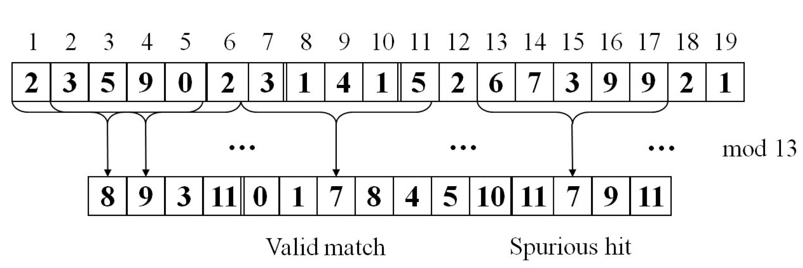

#genome

##应用介绍
genome是一个关于gene(基因)的应用程序。
给定一系列segments(基因片段)，它们的长度一样，算法的目的是试图恢复出包含这些片段的gene，而且这个gene越小越好。  

举个例子，我们有如下segments: TCGG, GCAG, ATCG, CAGC, GATC，我们可以恢复出如下长度为10的gene。

        TCGG
           GCAG
       ATCG
            CAGC
      GATC
     =============
      GATCGGCAGC

算法大致分为3步
- 使用hashtable去除重复的segment
- 根据Rabin-Karp字符串搜索算法的思想，合并部分segment。先合并重叠长度为n-1的，再合并n-2的，最后合并重叠长度为1的segment。
- 构建目的gene。

上述的算法前两步会并行执行。

##背景知识
Rabin-Karp算法是一个字符串搜索算法，目的和大名鼎鼎的KMP算法一样，但是理解起来相对容易。 
 
假设有一个大的字符串t,长度为n,和一个要匹配的字符串s，长度为m，n>>m。
Rabin-Karp算法的想法是为t每一个长度为m的子串求一个hash值，然后和s的hash值匹配，
如果匹配上了，再去匹配字符串本身。正常情况下计算hash值的复杂度是o(m)，
所以整个算法依然是o(mn)。但是如果设计较好的hash算法，
让每个子串的hash值通过它前一个子串的hash值快速算出来（因为他们毕竟有m-1个字符完全一样），
这样平均复杂度就能降低到o(n)。  

假设t = 2359023141526739921，s = 31415。它们都是字符串，且假设子串的hash值就是它代表的数字mod 13,那么我们可以花o(m)的时间算出23590的hash值为8。

在算35902的hash的时候，我们不需要重新花o(m)的时间，因为这两个字符串有4位是相同的，因此我们可以知道，  

	35902=(23590-2 * 10000)* 10+2，  
	35902 mod 13=（8 - 2 * 3）*10+2 mod 13 = 9。  
之后可以依次算完全部的hash值，如果hash值与31415匹配，再检查整个字符串是否相等。整个过程如上图所示。

##具体实现
README文件中推荐非模拟器执行的时候使用如下参数

	-g16384 -s64 -n16777216
这里的g表示gene的长度，s表示每个segment的长度，n表示随机生成的segment的个数。

###初始化
作者的实现中，一开始随机生成了长度为g的gene，然后根据这个gene，随机找它的开始位置，生成n个segment，并且保证这n个segment能够完全覆盖gene的全部内容。之后则是根据这n个segment，逆向恢复出gene。

经过一系列初始化之后，主线程起了多个线程，共同执行sequencer.c文件中的sequencer_run这个函数。  
###step 1
sequencer_run的step 1是使用hashtable清理重复的segment。
首先把segment所在的数组均匀地分成t段，t为线程数。
每个线程循环把数组中segment插入到hashtable中，这个过程使用TM进行保护。
为了防止开销太大，实现的时候把CHUNK_STEP1个insert放在同一个transaction中。

之后使用thread_barrier等待所有线程执行完毕，进入step2-a。
###step 2-a
2-a把所有segment从hashtable中取出来，放到一个数组中。这个数组没有重复元素。
之后，2-a计算每个独立的segment的所有前缀的hash值，分别放在s-1个hashtable里面，分别表示前缀长度为s-1到1。这一步的目的是为了之后合并方便。

比如我们想要知道GCAT能和哪些segment合并，所以我们首先计算它的尾部CAT的hash值，并在前缀长度3的hashtable里面寻找匹配。找到了就进行合并，没找到的话再尝试尾部AT，在前缀长度为2的hashtable里面寻找。  
有另一个segment是ATCG，它的前缀为A，AT，ATC三种，所以上面的算法会在前缀长度为2的hashtable里面找到ATCG，并且两个segment可以合并，变成GCATCG。

2-a把segment放回数组的过程需要TM，往s-1个hashtable里面插入元素也需要TM保护。

###step 2-b
回顾一下我们的目的是进行segment的合并。2-b做的事就是执行s-1轮合并操作，第一轮尝试合并公共部分长度s-1的情况，之后逐渐减少公共长度。

为了支持segment的合并，每个segment还有若干个变量，分别是isStart，isEnd，nextPtr。segment合并之后，这些变量值需要做相应地修改。

对于每一轮迭代，首先是找到isEnd为True的segment，在hashtable中找到头部和它的尾部一样，且isStart为True的segment。然后把这两个segment合并起来。这个合并操作用TM保护。

###step 2-c
每一轮合并完之后，修改所有isEnd为True的segment的尾部的hash值，供下一轮使用。这一个阶段实现中是单线程的。

###step 3
最后做一些收尾的工作，比如如果有多个不同的链，把它们连起来即可。

##Transaction分析
- 把segment插入到uniqueSegmentsPtr中。去重。

---
- 把segment从hashtable移到array里。
- 把独立的segment插入到前缀hashtable中。s-1个表。
- 把segment插入到hashtable中，方便快速查找。1个表。

---
- 合并segment。

(transaction之间的线表示有barrier)

其中第三个transaction可以拆分成不同的transaction保护，因为s-1个表不会互相干扰。性能瓶颈也是在这里的前缀为1的hashtable的构建。因为它只有4种可能……

